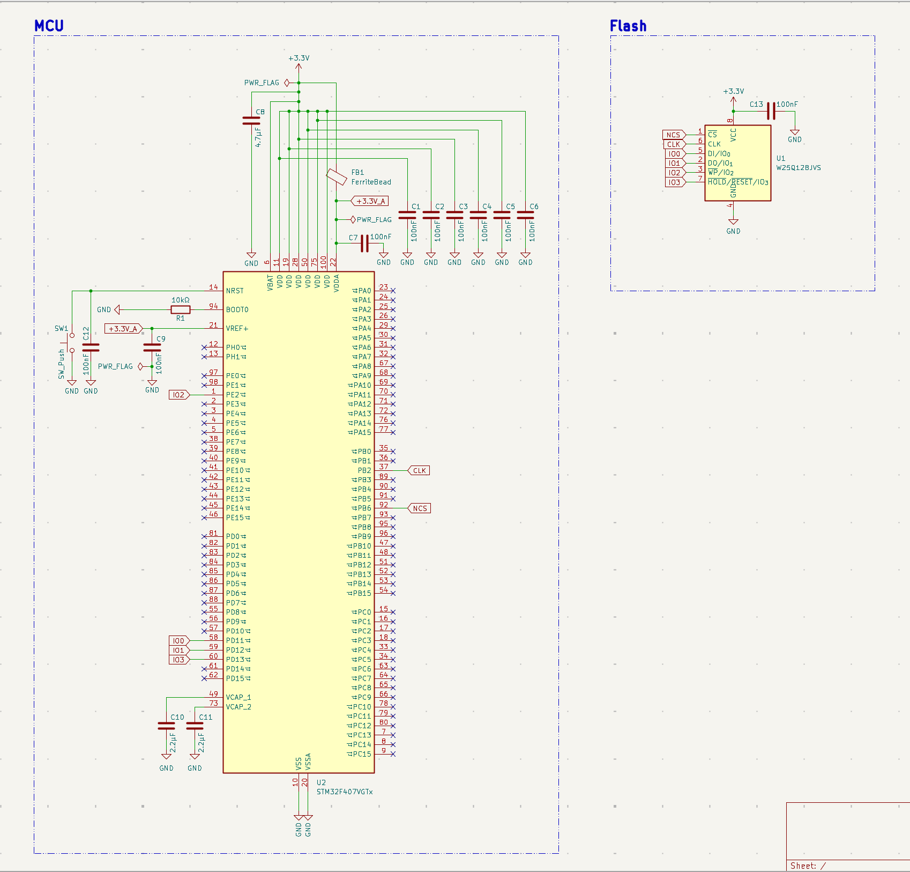
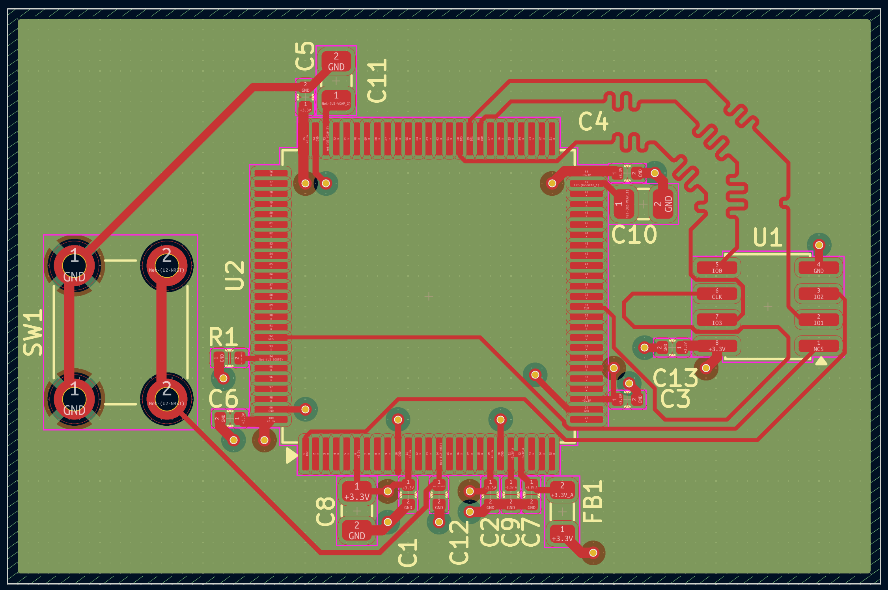

# STM32-QSPI-Flash-Board

A high-speed QSPI interface board: an STM32F407VG reading and writing an
external W25Q128JVS NOR flash chip over a full 4-bit Quad-SPI bus, on a
4-layer, controlled-impedance, length-matched design.

## Schematic

## PCB Layout

## Overview

This board pairs the STM32F407's QUADSPI peripheral (Bank1) with a 16MB
Winbond flash chip, intended as fast external storage for applications like
data logging or firmware staging — workloads where a single-bit SPI EEPROM
would be too slow.

## Design notes

**Power architecture:** 6×VDD pins each get individual 100nF decoupling.
VDDA is isolated from the main 3.3V rail through a ferrite bead and given its
own decoupling, since any digital switching noise on the shared rail can
corrupt ADC readings. VREF+ shares the filtered VDDA rail per the datasheet's
guidance. The two VCAP pins (required by the chip's internal core regulator)
each get a dedicated 2.2µF capacitor — this is mandatory, not optional, for
the chip to start up reliably.

**QUADSPI bus:** CLK, NCS, and IO0-IO3 connect the STM32 to the flash chip
using ST's documented Bank1 pin mapping (PB2, PB6, PD11, PD12, PD13, PE2).
All six signals are routed at 0.2mm width on F.Cu, directly over the
dedicated In1.Cu ground plane, to maintain a consistent ~50Ω single-ended
impedance.

**Length matching:** the STM32's QUADSPI pins are split across two different
edges of the 100-pin package — CLK/NCS exit from one side, the four data
lines from another. This made equal-length routing significantly harder than
a single-edge bus would be, and pushed the design through several rounds of
placement adjustment and deliberate trace lengthening (using gentle,
wide-radius meanders rather than tight serpentines, to avoid introducing
reflections on the clock line) before reaching the final result below.

| Iteration | Spread (longest − shortest) | Approx. skew |
|---|---|---|
| Initial placement | ~38mm | ~228ps |
| After 3 rounds of placement adjustment | ~17.2mm | ~103ps |
| After targeted length tuning | ~9.9mm | ~60ps |
| Final | **~3.0mm** | **~18ps** |

The final 3mm spread corresponds to roughly 18ps of skew, comfortably within
the general guideline threshold (~60ps) for reliable 80MHz QUADSPI
operation, with substantial margin to spare. If a future revision needs even
more headroom, dropping the target clock to 50MHz would relax this budget
further still.

## Manufacturing

- 4-layer stackup: F.Cu (signal) / In1.Cu (GND plane) / In2.Cu (power plane)
  / B.Cu (routing overflow)
- Passed DRC with 0 violations, 0 unconnected nets
- Gerbers and drill files generated

## Tools

- KiCad